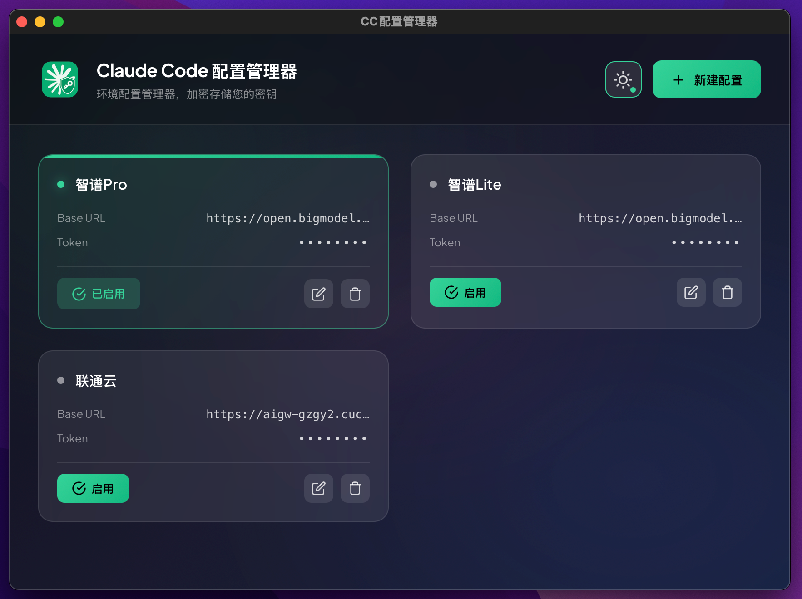

# CC配置管理器

<div align="center">
  

  <p><strong>Claude Code 环境配置管理器 - 安全管理您的 API 密钥</strong></p>

  <p>
    
    
    
    
  </p>
</div>

## 简介

CC配置管理器是一个桌面应用程序，用于管理 [Claude Code](https://claude.ai/code) 的环境配置。它允许您保存多个配置方案，并在不同配置之间快速切换，同时使用 AES-256-GCM 加密算法安全存储您的 API 密钥。

## 功能特性

- **多配置管理** - 创建、编辑、删除多个 Claude Code 环境配置
- **快速切换** - 一键激活任意配置，自动更新 `~/.claude/settings.json`
- **安全加密** - 使用 AES-256-GCM 加密存储敏感信息（API Token）
- **自动导入** - 首次使用时自动从现有 `settings.json` 导入配置
- **实时同步** - 监听 `settings.json` 文件变化，自动同步激活状态
- **双主题支持** - 支持亮色/暗色主题切换
- **原生体验** - 基于 Tauri 2 构建，轻量高效

## 安装

### 从源码构建

```bash
# 克隆仓库
git clone https://github.com/your-username/claude-code-settings-env.git
cd claude-code-settings-env

# 安装依赖
pnpm install

# 开发模式
pnpm tauri dev

# 构建生产版本
pnpm tauri build
```

## 使用方法

1. **创建配置** - 点击右上角「新建配置」按钮
2. **填写信息** - 输入配置名称、API Token、Base URL 等信息
3. **激活配置** - 点击配置卡片上的「激活」按钮，自动应用到 Claude Code
4. **编辑/删除** - 悬停配置卡片显示操作按钮

### 支持的配置项

| 配置项 | 说明 | 必填 |
|--------|------|------|
| `ANTHROPIC_AUTH_TOKEN` | API 认证令牌 | 是 |
| `ANTHROPIC_BASE_URL` | API 基础 URL | 是 |
| `API_TIMEOUT_MS` | API 超时时间（毫秒） | 否 |
| `CLAUDE_CODE_DISABLE_NONESSENTIAL_TRAFFIC` | 禁用非必要流量 | 否 |
| `CLAUDE_CODE_DISABLE_EXPERIMENTAL_BETAS` | 禁用实验性功能 | 否 |
| `ENABLE_TOOL_SEARCH` | 启用工具搜索 | 否 |
| `ANTHROPIC_DEFAULT_HAIKU_MODEL` | 默认 Haiku 模型 | 否 |
| `ANTHROPIC_DEFAULT_SONNET_MODEL` | 默认 Sonnet 模型 | 否 |
| `ANTHROPIC_DEFAULT_OPUS_MODEL` | 默认 Opus 模型 | 否 |

## 技术栈

- **前端**: Vue 3 + TypeScript + Vite
- **后端**: Rust + Tauri 2
- **加密**: AES-256-GCM + SHA256（基于机器 ID 生成密钥）
- **存储**: Tauri Plugin Store（本地加密存储）

## 安全说明

- 所有 API Token 均使用 AES-256-GCM 加密后存储在本地
- 加密密钥基于机器唯一 ID 生成，每台设备密钥不同
- 配置文件存储在应用数据目录中，与其他应用隔离
- 加密数据仅在本地存储，不会上传到任何服务器

## 开发

```bash
# 安装依赖
pnpm install

# 启动开发服务器
pnpm tauri dev

# 仅启动前端开发服务器
pnpm dev

# 类型检查
pnpm build
```

## 许可证

MIT License
